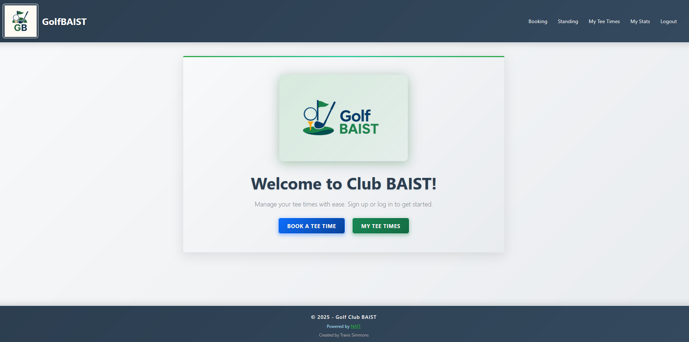
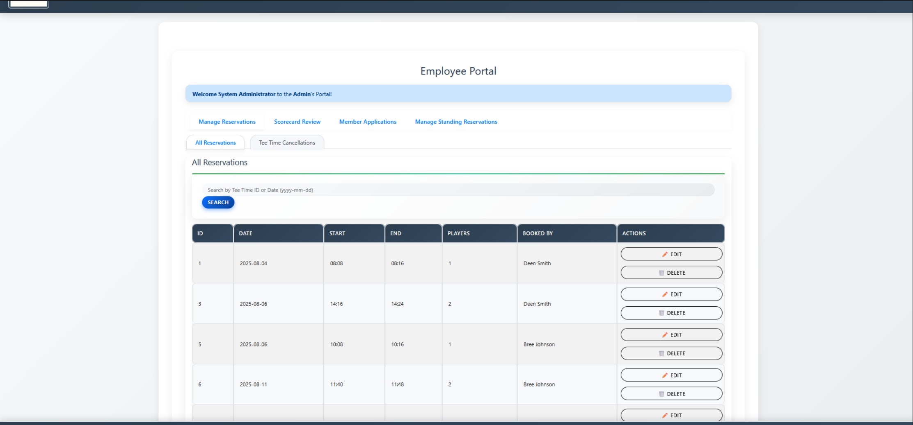

# Golf Club BAIST

<!-- Preview for Employers: The following images showcase the main entry points and UI of the application. -->

These screenshots provide a first look at the user experience and core functionality. The landing page welcomes users and provides access to tee time management, while the Employee Portal demonstrates the administrative capabilities for managing reservations and club operations. Both are tightly integrated with the backend logic and database.

Golf Club BAIST is a modern web application for managing golf club tee times, reservations, scorecards, and member services. The app is built with C# and ASP.NET Core Razor Pages, using a SQL database for persistent storage. The UI you see above is directly powered by the backend logic and models, with each page and feature mapped to a corresponding Razor Page and C# service. This architecture ensures a seamless, secure, and maintainable workflow for both members and employees.

## Features
- Member registration and login
- Tee time booking and management
- Employee portal for managing reservations, scorecards, and member applications
- Scorecard entry and review
- Standing tee time requests
- Modern, responsive UI

## Technologies & Architecture
- ASP.NET Core (C#)
- Razor Pages (MVC pattern)
- SQL Server (relational database)
- HTML, CSS, JavaScript

The application uses Entity Framework Core for ORM, with all business logic in C# services. SQL tables store members, tee times, reservations, scores, and more. The UI is fully responsive and modern, designed for both desktop and mobile use.

## Getting Started
1. Clone the repository
2. Configure your SQL Server and connection strings in `appsettings.json`
3. Build and run the project with `dotnet run`

## About
This project was originally developed as a school project (2024–2025) and migrated to this public repository in June 2025. All code and features have been modernized for public and professional use.

---

Powered by [NAIT](https://www.nait.ca/)

---

> _Screenshots above: Landing page and Employee Portal. These are just a preview—see the codebase for full details on how the UI, backend, and database work together._

---

For more information, contact Travis Simmons.
